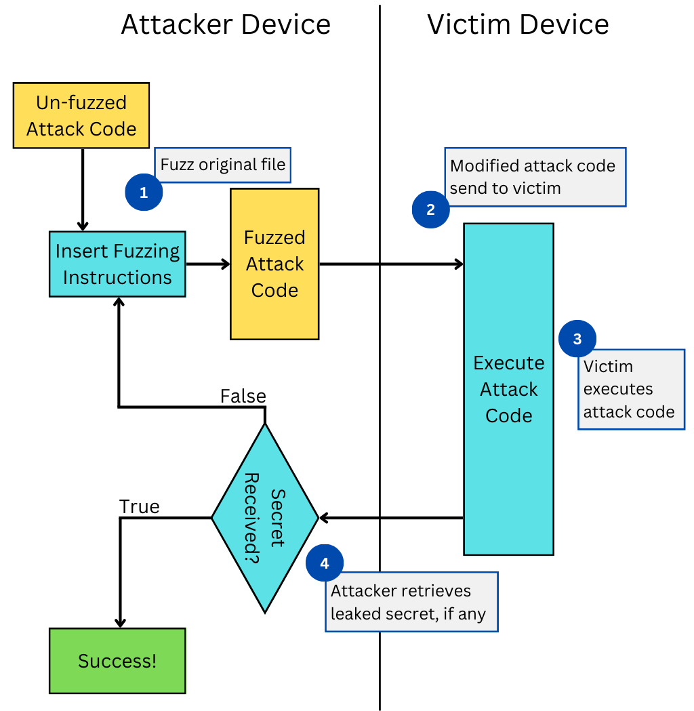

# FuzzingToolSCA
Systematical Evasion from Learning-based Microarchitectural Attack Detection Tools

## Roadmap
The fuzzing framework is designed to automatically modify the attack source code, requiring minimal human intervention and manual coding. The framework is based on the Python language to ease the insertion of code blocks to the source
code. The purpose is to manipulate the targeted HPCs by modifying the source code. This includes inserting wait times and additional instructions into the source code to change the HPC values while leaking secrets and evading ML-based
detection tools. 

## Fuzzing Framework Architecture
<p align="center">
  
</p>


## Setup


## Implementation


```bash
├── Systematic_fuzzing/ # Contains the Fuzzing framework with systematic fuzzing setting
    ├── targeted_attacks/ # Contains the source codes of the targeted attacks
        ├── Flush_Reload/
        ├── spectreV1/
        ├── spectreV2/
    ├── Tested_Detection_models/
        ├── Model_1/
        ├── Model_2/
        ├── Model_3/
        ├── Model_4/
    ├── utils/
    ├── framework.config
    ├── fuzzing_framework.py # main file
    ├── module_tester.py
├── Random_fuzzing/ # Contains the Fuzzing framework with random fuzzing setting
    ├── targeted_attacks/ # Contains the source codes of the targeted attacks
        ├── Flush_Reload/
        ├── spectreV1/
        ├── spectreV2/
    ├── Tested_Detection_models/
        ├── Model_1/
        ├── Model_2/
        ├── Model_3/
        ├── Model_4/
    ├── utils/
    ├── framework.config
    ├── fuzzing_framework.py  # main file
    ├── module_tester.py
```


## Authors
- Jonathan Tan (jona1115@iastate.edu)
- Debopriya Roy Dipta (roydipta@iastate.edu)
- Berk Gulmezoglu (bgulmez@iastate.edu)

