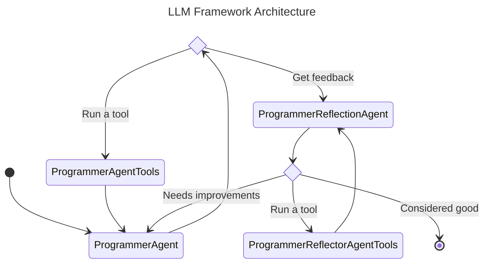

# FuzzingToolSCA
Systematical Evasion from Learning-based Microarchitectural Attack Detection Tools
# Micro-architectural Attack LLM Framework (MALF)
> [!NOTE]
> The framework's name is subject to change

## Roadmap
The fuzzing framework is designed to automatically modify the attack source code, requiring minimal human intervention and manual coding. The framework is based on the Python language to ease the insertion of code blocks to the source
code. The purpose is to manipulate the targeted HPCs by modifying the source code. This includes inserting wait times and additional instructions into the source code to change the HPC values while leaking secrets and evading ML-based
detection tools. 

Tools:
- [x] C compiler

LLM providers:
- [x] [OpenAI](https://python.langchain.com/v0.2/docs/integrations/platforms/openai/)


Chat models:
- OpenAI
    - [x] GPT-4o
    - [ ] GPT-4


## Setup

The LLM framework is containerized to ease dependency management and code execution. Make sure that you have [Docker Engine](https://docs.docker.com/engine/install/) including the Docker Compose plugin installed on your system. All explanations in this file assume that the user account is a member of the `docker` group to run `docker` commands without `sudo`. If you want to run docker without `sudo`, add your user to the `docker` group by running the following command:

```shell
$ sudo usermod -aG docker $USER
```

Create a `.env` file in the same directory as the `docker-compose.yml` file with the following content:

```env
OPENAI_API_KEY="..."
LANGCHAIN_TRACING_V2=true
LANGCHAIN_ENDPOINT="https://api.smith.langchain.com"
LANGCHAIN_API_KEY="..."
LANGCHAIN_PROJECT="..."
UNAME="llm"
UID="1000"
GID="1000"
```

The `LANDCHAIN_*` variables are optional and only required if you want to use [LangSmith](https://smith.langchain.com) to track the execution of your code. The `OPENAI_API_KEY` variable is required if you want to use the OpenAI API to access their LLMs. The `UNAME`, `UID`, and `GID` variables are required to ensure that the files created in the container are owned by the correct user and group.

Fill in the missing parts (`"..."`) with the appropriate values. Also, if your user and group ID is not `1000`, change the `UID` and `GID` values accordingly. The files created in the container will be owned by the user with the specified UID and GID. Run the `id` command in your terminal to find out your user and group ID.

Create a folder called `workdir` in the same directory as the `docker-compose.yml` file. This folder will be mounted in the container as `~/workdir` and contain the LLM-generated source code files and binaries for every run of the framework.

After these setup steps, you can run the LLM toolchain by executing the following command:

```shell
$ docker compose up --build
```

This command will (re-)build the container image, start the container and then run the framework inside the container. If you make changes to the framework, you can rebuild the container by running the same command again.


## Concepts

An *agent* is an LLM instance associated with a prompt template and a list of accessible tools.
A *tool* is a Python function that can be called by an agent to interact with the system it is running on.


## Architecture

The architecture consists of multiple LLM agents that play different roles and interact with each other and the system.

The current implementation of the framework consists of the following agents:
1. **Programmer Agent:** The agent is tasked with generating a PoC for a given attack vector and programming language. The programmer agent can use the programmer agent tools to compile the generated source code and ask the programmer reflection agent for feedback.

2. **Programmer Agent Tools:** The tools provide the ability for the programmer agent to interact with the system it is running on. The output of the tools is returned to the programmer reflection agent.
> [!NOTE]
> This is not strictly speaking an agent as it does not involve any AI model.

> [!NOTE]
> Currently, the only tool provided is a C compiler. More tools will be added in the future.

3. **Programmer Reflection Agent:** The agent is tasked with analyzing the output of the programmer agent and its tools and generating feedback. The programmer reflection agent can use the programmer reflector agent tools to reason about the output and behaviour of the compiled binary. The feedback is fed back to the programmer agent to improve the generated code.

4. **Programmer Reflector Agent Tools:** The tools provide the ability for the programmer reflection agent to interact with the system it is running on. The output of the tools is returned to the programmer reflection agent.
> [!NOTE]
> This is not strictly speaking an agent as it does not involve any AI model.

> [!NOTE]
> Currently, the only tool provided is a tool to execute the compiled binary and measure performance counters that the reflection agent is interested in. More tools will be added in the future.



> [!NOTE]
> This diagram can be altered according to the  [Mermaid State Diagram](https://mermaid.js.org/syntax/stateDiagram.html) documentation.

## Implementation

The framework is implemented in Python. It uses [LangChain](https://python.langchain.com/v0.2/docs/introduction/) to access LLM agents and model their interaction as a graph where the nodes represent agents and the tools that they have access to and the edges represent the allowed state transitions. The graph is modeled with [LangGraph](https://langchain-ai.github.io/langgraph/).

The source code is located in the `app` folder, which currently has the following structure:

```bash
app/ # Root folder for the LLM framework
├── agents/ # Contains the agents
│   ├── programmer/ # Contains the programmer and reflection agents
│   ├── prompts/ # Contains all prompts
│   ├── BaseAgent.py # The base class for all agents
│   ├── BaseReflectionAgent.py # The base class for all reflection agents
│   ├── AgentState.py # The state that is used to pass information between agents
├── tools/ # Contains the tools that the agents have access to
├── app_config.py # The configuration of the application
├── model_configs.py # The LLM models to be tested
├── graph.py # The graph that models the agents and their transitions as depicted in the state diagram above
├── app.py # The entry point of the framework
```
